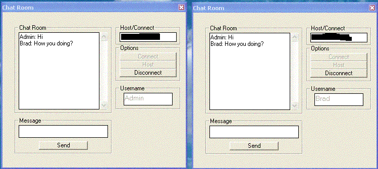



## Brad's Winsock Chat Tutorial

### Description

Simple Winsock Tutorial...Commented and EASY to understand
 
### More Info
 

             |
---                |---
**Submitted On**   |2002-06-18 00:51:54
**By**             |[Brad Savon](https://github.com/Planet-Source-Code/PSCIndex/blob/master/ByAuthor/brad-savon.md)
**Level**          |Beginner
**User Rating**    |4.0 (16 globes from 4 users)
**Compatibility**  |VB 6\.0
**Category**       |[Complete Applications](https://github.com/Planet-Source-Code/PSCIndex/blob/master/ByCategory/complete-applications__1-27.md)
**World**          |[Visual Basic](https://github.com/Planet-Source-Code/PSCIndex/blob/master/ByWorld/visual-basic.md)
**Archive File**   |[Brad's\_Win957556182002\.zip](https://github.com/Planet-Source-Code/brad-savon-brad-s-winsock-chat-tutorial__1-35983/archive/master.zip)

### API Declarations

NONE, Pure Winsock

